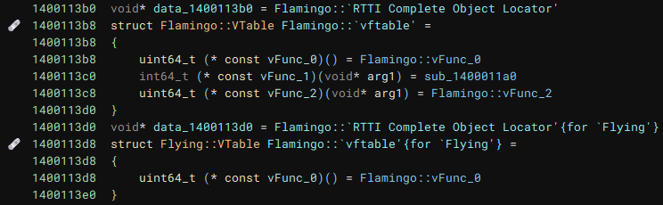
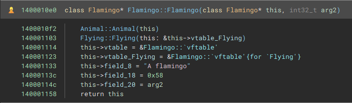
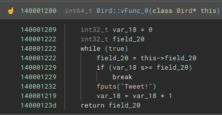
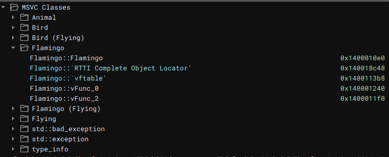

+++
title = "binja-msvc"
date = "2023-04-01"
description = "Parsing and symbolizing MSVC runtime type information in Binary Ninja."

[extra]
source = "https://github.com/emesare/binja-msvc"
+++

### Virtual function table structuring

### Constructor identification

### Virtual function ownership resolution

### Components support

